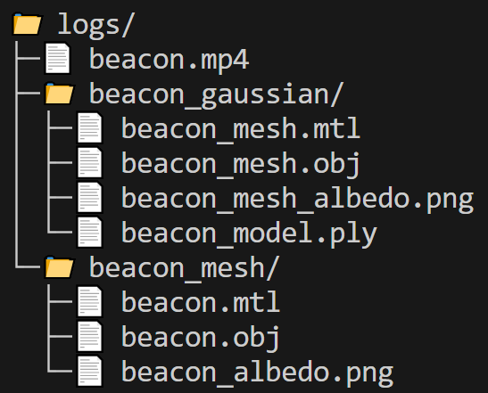
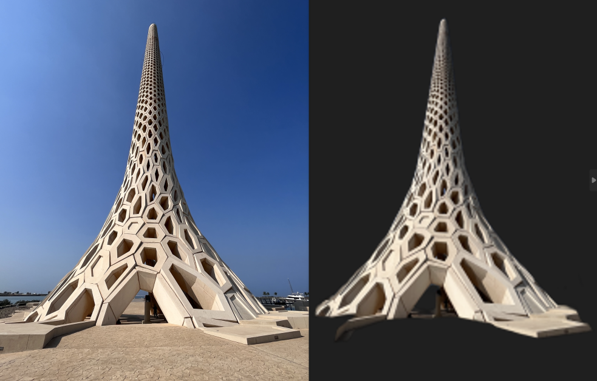
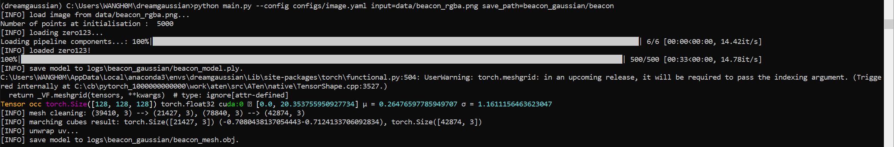
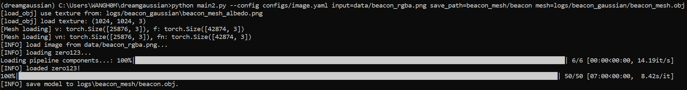
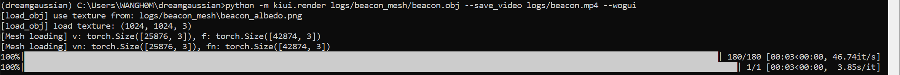
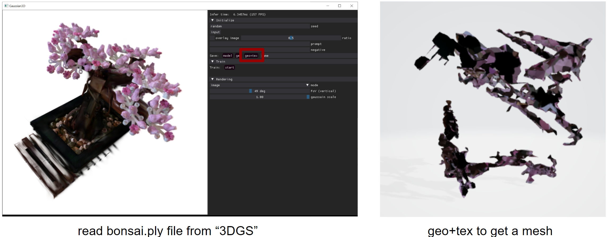

# DreamGaussian

Original implementation of the paper [DreamGaussian: Generative Gaussian Splatting for Efficient 3D Content Creation](https://arxiv.org/abs/2309.16653).
[Project Page](https://dreamgaussian.github.io) | [Arxiv](https://arxiv.org/abs/2309.16653)

---------------------------------------------------------------------------
* [Install](#install)
    * [Setting environment](#setting-environment)
    * [Setting packages](#setting-packages)
* [Image-to-3D](#image-to-3D)
    * 1. Process the initial image
    * 2. Train Gaussian stage
    * 3. Train mesh stage
    * 4. Visualization
    * 5. Evaluation 
* [Conclusion](#conclusion)
* [Get a mesh from given .ply file](#get-a-mesh-from-given-.ply-file)
    * [Load a .ply file into GUI](#load-a-.ply-file-into-gui)
    * [First training to get an initial mesh](#first-training-to-get-an-initial-mesh)
    * [Second training to get a finer mesh](#second-training-to-get-a-finer-mesh)
---------------------------------------------------------------------------

## Install

* Hui: Windows 10 with torch 2.1 & CUDA 12.1 on a RTX A4500.

* Hui: problem with pip install ./diff-gaussian-rasterization ./simple-knn --> need to install 'cuda_12.1.0_windows_network'

* Hui: problem with diff_gaussian_rasterization and simple_knn._C path problem --> add __init__.py file inside folder diff-gaussian-rasterization and simple-knn

### Setting environment

<details>
<summary><span style="font-weight: bold;">Environment</span></summary>

    ```bash
    install 'cuda_12.1.0_windows_network'

    open anaconda prompt

    cd C:\Users\NAME

    git clone https://github.com/dreamgaussian/dreamgaussian --recursive

    cd cd C:\Users\NAME\dreamgaussian

    conda create -n dreamgaussian

    conda activate dreamgaussian
    ```
</details>

### Setting packages

<details>
<summary><span style="font-weight: bold;">Package</span></summary>

    ```bash
    pip install -r requirements.txt

    # a modified gaussian splatting (+ depth, alpha rendering)
    git clone --recursive https://github.com/ashawkey/diff-gaussian-rasterization
    pip install ./diff-gaussian-rasterization

    # simple-knn
    pip install ./simple-knn

    # nvdiffrast
    pip install git+https://github.com/NVlabs/nvdiffrast/

    # kiuikit
    pip install git+https://github.com/ashawkey/kiuikit
    ```

</details>

## Image-to-3D

Parameters are set in `./configs/image.yaml`.

<details>
<summary><span style="font-weight: bold;">File structure of folder `./logs`</span></summary>

    

</details>

### 1. Process the initial image: (below choose 1/3)
```bash
# background removal and recentering, save rgba at 256x256
python process.py data/name.png

#----------------------------------
# save at a larger resolution
python process.py data/name.png --size 512
#----------------------------------

# process all jpg images under a dir
python process.py data
```


### 2. Train Gaussian stage: (below choose 1/5)

If donot need to show GUI, one can directly choose 1 of below 3 commonds:
```bash
## New file by Hui:
python main_anacondaprompt.py --config configs/image.yaml input=data/name_rgba.png save_path=name_gaussian/name

# train 500 iters (~1min) and export ckpt & coarse_mesh to logs/name_gaussian
python main.py --config configs/image.yaml input=data/name_rgba.png save_path=name_gaussian/name

# use an estimated elevation angle if image is not front-view (e.g., common looking-down image can use -30)
python main.py --config configs/image.yaml input=data/name_rgba.png save_path=name_gaussian/name elevation=-30
```

If one need to show GUI, choose one:
```bash
#----------------------------------
# gui mode (supports visualizing training)
python main.py --config configs/image.yaml input=data/name_rgba.png save_path=name_gaussian/name gui=True
#----------------------------------

# load and visualize a saved ckpt
python main.py --config configs/image.yaml load=name_gaussian/name_model.ply gui=True
```



https://github.com/WWmore/dreamgaussian/assets/28695253/035a5fc8-b305-4b5f-a14d-35c0a9565bc4


### 3. Train mesh stage: (below choose 1/5)

If donot need to show GUI, one can directly choose 1 of below 4 commonds:
```bash
## New file by Hui:
#----------------------------------
# specify coarse mesh path explicity
python main2_anacondaprompt.py --config configs/image.yaml input=data/name_rgba.png save_path=name_mesh/name mesh=logs/name_gaussian/name_mesh.obj
#----------------------------------

# specify coarse mesh path explicity
python main2.py --config configs/image.yaml input=data/name_rgba.png save_path=name_mesh/name mesh=logs/name_gaussian/name_mesh.obj

# auto load coarse_mesh and refine 50 iters (~1min), export fine_mesh to logs/name_mesh
python main2.py --config configs/image.yaml input=data/name_rgba.png save_path=name_mesh/name

# export glb instead of obj
python main2.py --config configs/image.yaml input=data/name_rgba.png save_path=name_gaussian/name mesh_format=glb
```

```bash
# gui mode
python main2.py --config configs/image.yaml input=data/name_rgba.png save_path=name_gaussian/name gui=True
```



https://github.com/WWmore/dreamgaussian/assets/28695253/db26e49f-703b-467b-885a-8301f70c5907


### 4. Visualization: (below choose 1/3)
```bash
# gui for visualizing mesh
python -m kiui.render logs/name_mesh/name.obj

#----------------------------------
# save 360 degree video of mesh (can run without gui)
python -m kiui.render logs/name_mesh/name.obj --save_video logs/name.mp4 --wogui
#----------------------------------

# save 8 view images of mesh (can run without gui)
python -m kiui.render logs/name_mesh/name.obj --save logs/name/ --wogui
```


https://github.com/WWmore/dreamgaussian/assets/28695253/a88cd3aa-8ef5-46e6-a706-f6620ba3ed02

### 5. Evaluation
```bash
### evaluation of CLIP-similarity
##Hui note: AttributeError: 'Namespace' object has no attribute 'force_cuda_rast'
python -m kiui.cli.clip_sim data/name_rgba.png logs/name_mesh/name.obj
```

## Conclusion

* The whole process has GUI layouts to navigate, but the rotation is very sensitive.
* Both training in Step2 (Gaussian) and Step3 (Mesh) are fast. Highly depends on the hardware.
* However, both 3D Gaussian Splatting and generated mesh look bad. 
* The mesh has a very large background area of blur texture.
* Starting from 1 image to produce a mesh is not suitable for the parametric designed model.
* Resolutions are low.


---------------------------------------------------------

## Get a mesh from given .ply file

### Load a .ply file into GUI
```bash
python main.py --config configs/image.yaml load=logs/bonsai.ply save_path=name gui=True
```

### First training to get an initial mesh
The `extract_mesh` function cannot help to get a good mesh:


### Second training to get a finer mesh
Stuck: Only after getting a good initial mesh, can process it to be a finer mesh.
